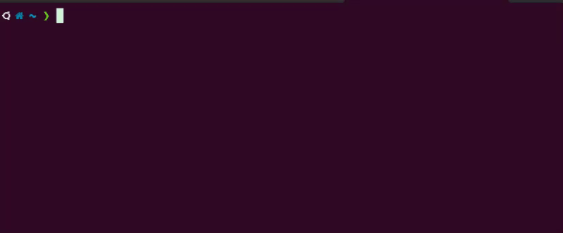

# ⚡ snipflow

Stop copy-pasting code. Instantly save and reuse snippets from your terminal.

```bash
npm install -g snipflow
```

---

## 🚀 Interactive Snippet Picker



Search, preview and copy snippets in seconds with a beautiful interactive UI.

* 🔍 Real-time search
* 👀 Live preview
* ⚡ Instant copy to clipboard
* ⌨️ Keyboard navigation

👉 Try it now:

```bash
snip
```

---

## ⚡ Quick Start

Save a snippet:

```bash
snip save fetch-user
```

Open interactive picker:

```bash
snip
```

Or get directly:

```bash
snip get fetch-user
```

---

## 🧠 How it works

### Interactive mode

```bash
snip
```

* Type to search
* Navigate with ↑ ↓
* Press Enter to copy
* Press Esc to exit

### Example

```
Search snippets... (type to filter) — 2 results

❯ fetch-user
  fetch-products

Preview:
------------------------
  fetch('/api/users')
  .then(res => res.json())

↑↓ navigate • Enter copy • Esc cancel
```

---

## ✨ Features

* ⚡ Interactive snippet picker (main feature)
* 🔍 Real-time search
* 👀 Preview before copying
* 📋 Clipboard integration
* ⚡ Instant copy on selection
* 🧠 Smart UX (keyboard-first)
* 💾 Local storage (no setup needed)

---

## 🛠 Commands

```bash
snip save <name>     # Save snippet from clipboard
snip get <name>      # Copy snippet to clipboard
snip search <term>   # Search snippets
snip list            # List all snippets
snip                 # Open interactive picker
```

---

## 🎯 Why snipflow?

Copy-pasting code is:

* ❌ repetitive
* ❌ slow
* ❌ error-prone

snipflow makes it:

* ⚡ fast
* 🧠 organized
* 🎯 effortless

---

## 🚀 Roadmap

* [ ] Snippet history (`snip last`)
* [ ] Snippet delete (`snip delete`)
* [ ] Tags & filtering

---

## 🤝 Contributing

PRs are welcome. Feel free to open issues or suggest improvements.

---

## ⭐ Support

If this helped you, consider giving a star ⭐
